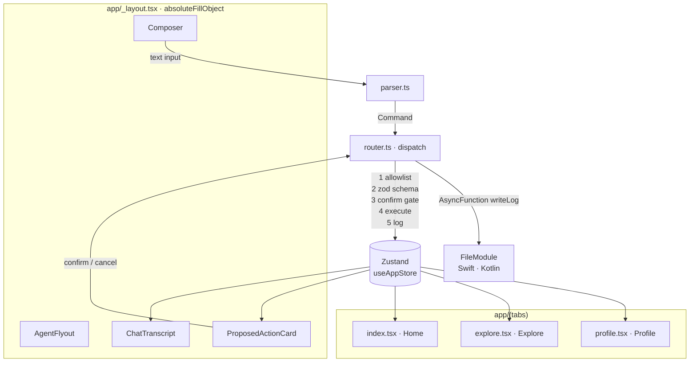

# Architecture

## Dataflow

## Component map

| Path | Role |
|---|---|
| `app/_layout.tsx` | Mounts `<AgentFlyout/>` and `<ProposedActionCard/>` inside an `absoluteFillObject` overlay above `<Stack>` so both survive tab switches — that is what "anchored" means in the brief. |
| `app/(tabs)/index.tsx` | Home: shortcuts that exercise `dispatch` directly (open flyout, navigate, dispatch an intentionally invalid command, propose dark mode). |
| `app/(tabs)/explore.tsx` | Filter pills + asc/desc; reads `exploreFilter` from Zustand. `applyExploreFilter` writes here. |
| `app/(tabs)/profile.tsx` | `darkMode` toggle (via `dispatch(setPreference)`, so the UI path and the agent path share the same gate), `Export Audit Log` button, the full activity log list. |
| `src/agent/types.ts` | `Command` union, `ActivityEntry`, `DispatchResult`. |
| `src/agent/schemas.ts` | Zod schemas keyed by command `type`. |
| `src/agent/parser.ts` | Deterministic NL → `Command` (~6 regex patterns). Swappable — documented seam for a future LLM. |
| `src/agent/router.ts` | `dispatch`, `confirmPendingCommand`, `cancelPendingCommand`. Allowlist → zod → confirm gate → execute → log. |
| `src/agent/ui/AgentFlyout.tsx` | `@gorhom/bottom-sheet`, snaps at 50% / 80%. |
| `src/agent/ui/ChatTranscript.tsx` | Renders the activity log inverted as a chat, status-coloured bubbles. |
| `src/agent/ui/Composer.tsx` | `TextInput` → `parseInput` → `dispatch`. Surfaces `helpText` when the parser returns null. |
| `src/agent/ui/ProposedActionCard.tsx` | Reads `pendingCommand` from Zustand; only calls `confirmPendingCommand` / `cancelPendingCommand`. Never calls setters. |
| `src/store/useAppStore.ts` | Zustand store (`preferences`, `activityLog`, `flyoutState`, `exploreFilter`, `pendingCommand`). Persisted via AsyncStorage with a memory fallback so Jest imports cleanly. |
| `modules/file-module/ios/FileModule.swift` | `AsyncFunction("writeLog")` using `FileManager.default.urls(for: .documentDirectory)`. Appends with ISO-8601 timestamp + separator; creates on first write. |
| `modules/file-module/android/src/main/java/expo/modules/filemodule/FileModule.kt` | Same surface using `context.filesDir` and `java.io.File.appendText`. |
| `__tests__/router.test.ts` | Proves off-allowlist rejection is logged, malformed payloads are rejected as `schema-fail`, and the confirmation gate parks `setPreference` as `pending` instead of executing. |
| `__tests__/parser.test.ts` | Secondary coverage for the phrase patterns; not the gradeable test. |

## Invariants

1. **Only the router mutates app state or touches disk.** `src/agent/ui/**` does not import `useAppStore.setState` or `expo-router`'s navigate.
2. **Every command attempt is logged.** Entries cover `executed`, `rejected`, `pending`, `cancelled` — this is an audit trail, not a success log.
3. **Native module is app-private.** Paths resolve under `.documentDirectory` (iOS) or `filesDir` (Android). No external storage.
4. **The parser is swappable.** `parser.ts` returns `{ command, confidence, needsConfirm, helpText? }` — replacing it with a function-calling LLM is a one-file change.
